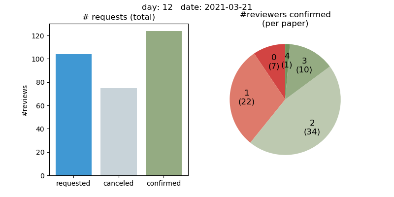
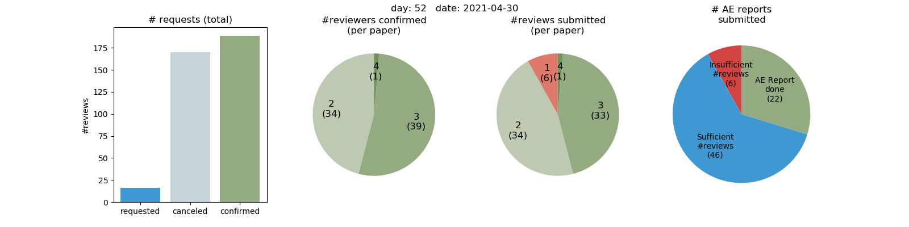

# Papercept Plots for Editors

One of the perks of being on the Editorial Board of IEEE conferences is that is makes you feel 25 years younger, because papercept's browser-based interface gives one regular flashbacks to the 90s. However, to get a quick visual overview of progress, the interface for Editors is not ideal. The aim of this Python script is to parse and visualize the "Submissions overview" HTML page in papercept.

This page explains the usage of the script for Editors, and also contains an ["Unofficial guide for Associate Editors"](https://github.com/stulp/papercept_plots#unofficial-guide-for-associate-editors) which I as Editor send to AE newcomers.

## Basic Usage (on one HTML file)

To visualize the status of the different papers, go to the "Submissions overview" view as an Editor (which lists all the papers), and download that HTML file. Then call the following:

```
python3 papercept_plot.py 'Submissions overview.html'
```

or 

```
python3 papercept_plot.py 'Submissions_overview_2021-03-13.html'
```

The advantage of adding the date to the filename is that papers that are overdue are listed and plotted in red in the graphs.

### Output during the first phase 

During the first phase of the process (AEs should find at least 2 confirmed reviewers per paper), this plots the graphs below. The pie chart shows at a glance that 7 papers have 0 confirmed reviewers, and 22 paper have 1 confirmed reviewer on 2021-03-21. They are plotted in red, as these papers are overdue.




It will also list the Associate Editors with overdue papers (e.g. not enough confirmed reviewers, not enough submitted reviews, etc.), for instance:

```
Insufficient number of confirmed reviews:
  1 < 2  167    John
  1 < 2  356    John
  1 < 2  1534   Jane
  0 < 2  1560   Jane
  ...
```

### Output during the second phase

During the second phase of the process (reviewers should submit reviews and AEs should write summary reports), the script plots the following:



The left two graphs show that all papers have 2, 3 or 4 reviewers (which is the result of the first phase). The right two graphs, which are more relevant in the second phase show that 6 papers still only have 1 submitted review (insufficient), and that 46 papers have a sufficient number of reviews, but no AE report yet. 22 papers have an AE report done, and can be endorsed by the Editor.

## Rationale

This script grew each year from a few lines of code in my first year as Editor. My motivation for doing so was:
* Not all Associate Editors are punctual and/or responsive. The anonymized graphs above (which I send to all Associate Editors in BCC about 4 times during the process) hopefully nudge the stragglers into action, rather than having to send them annoying e-mails. With 100 papers and ~15 reviewers, running after individual AEs is simply too time-consuming.
* Being an Editor for a big conference with many papers can become a bit "enumerative", so to speak. Tuning the script over the years made it a bit more fun.

Essentially, it is a gamification of the otherwise rather dry reviewing process.

## Batch mode

For the historically inclined, one may save intermediate results as pngs. To do this, the directory must contain multiple files with the following naming convention:

```
html/ # Or any name you want
  2021-03-13_Submissions_overview.html
  2021-03-16_Submissions_overview.html
  2021-03-19_Submissions_overview.html
  2021-03-20_Submissions_overview.html
  2021-03-21_Submissions_overview.html
```

To generate one PNG file for each HTML file, call `papercept_plot` on that directory:

```
python3 papercept_plot.py html/
```

## Unofficial guide for Associate Editors

For what it's worth, here is my strategy for finding reviewers. Please note that this is my personal strategy based on some years of experience as AE, not IEEE policy. In any case, read the official info for AEs before reading this.

Here are the phases I used to go through as an AE.

* Phase 0 (1 day): Go through the papers, use a summary reject if necessary (due to the paper having only 1 pages, etc.)
* Phase 1 (2 days, ask 2-3 people): PIN-POINTING. Ask people (whose work) you know, and who might really be interested. In papercept, you can look for reviewers based on last name.
* Phase 2 (3 days, ask 2-3 more people): WIDENING THE HORIZON. Go through the citations of the paper, and ask people that are cited. You may not know them, but at least the topic will fit (be careful for conflicts of interest at this point; people tend to cite themselves or direct colleagues a lot). Again, find the reviewers by last name in papercept.
* Phase 3 (3 days, ask 2-3 more people): ANYTHING GOES. Use the papercept search functionality to search by keyword. Look for reviewers with only a few, but matching keywords. It is more likely they will be interested in the topic than somebody with 100 keywords selected (Bayes' law).
* Phase 4: HELP! Ask the people you know again. Ask for favors, twist arms, etc. Ask your Editor for help.

The main thing is to avoid situations where you only ask 3 reviewers, wait two weeks, and nothing happens. It's better to ask 6 people, and then thankfully cancel some if 2 or 3 accept. For example, sometimes, I will ask 3 people from the same group, but cancel the other 2 once the first one has accepted (for reasons of diversity, it's not good to have multiple people from the same group).

What's the optimal amount of reviewers for a paper? With two reviewers for a paper, you risk the chance that their recommendations diverge. This can irritating, because the AE has to break the tie, and this basically means writing another review, or finding a third reviewer last-minute. But I also use three reviewers for one paper sparingly, as I think it is a waste of resources (so many papers to review already!). My strategy: if I think a paper is obviously bad (but not bad enough for a summary reject) or obviously good, I get two reviewers. If I am not so sure, I try to get three. 

It's good to find a good mix of more junior and more senior researchers. In my experience, and it is quite natural, junior researchers will be more diligent and punctual, but less secure in their reviews (more "Borderline" recommendations). Note that in the end, Editors only allow you to assign "Borderline" in exceptional cases. With ~100 papers, Editors do not have time to look at them and decide whether to accept or reject. Senior researchers tend to give clearer recommendations ("Definite Accept"), but I've also noticed a tendency for seniors to be late more often, or sometimes not submit the review at all. That top professor whom you were surprised accepted your invitation; well, that top professor may not submit their review or reply to your reminder e-mails later on :-(
 
